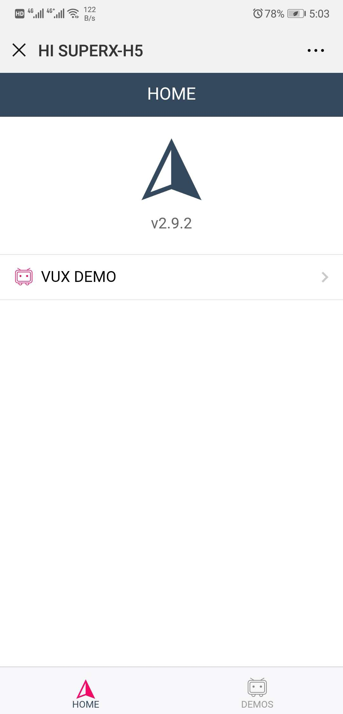
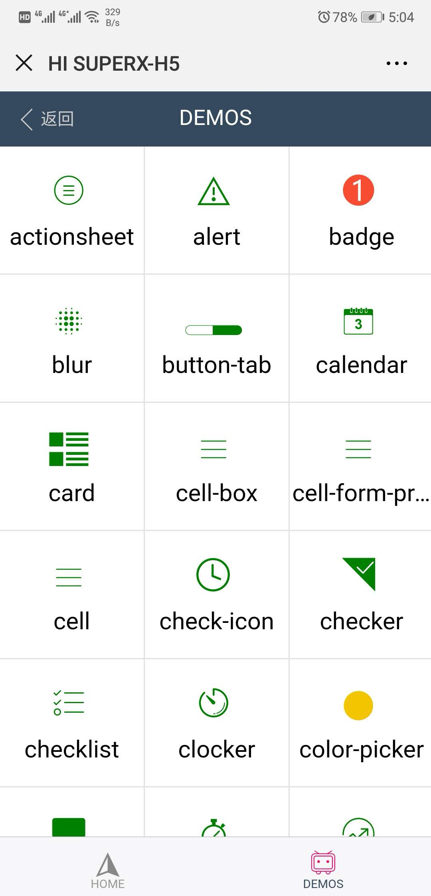

# SUPERX-H5

> A Mobile Vue.js Project
>
> based on this project start mobile project easily

## Build Setup

``` bash
# install dependencies
npm install

# serve with hot reload at localhost:8080
npm run dev

# build for production with minification
npm run build

# build for production and view the bundle analyzer report
npm run build --report

# run all tests
npm test
```

## profile

this project based on [VUX](https://doc.vux.li/zh-CN/)

use vuex-router-sync sync current $route as part of vuex store's state

## 从设计到开发

从设计到开发完整的 rem 适配方案

设计稿 750px, 前端开发 实际像素 / 100 = value rem

添加 像素密度 标识(`<html data-dpr="2">`)，安卓像素密度为1，iOS 按照实际设备设置data-dpr

添加 iOS 标识(`<html class="ios">`)，以便对Android 和 iOS 不同系统做特殊处理

## 目标设定

- 路由切换增加动画效果，增加用户体验

- 使用第三方组件库UVX满足日常开发需求

- 逐步增加组件使用范例，探索最佳实践

## demo

<p>
  <a>
    
  </a>
  <a>
    
  </a>
</p>
